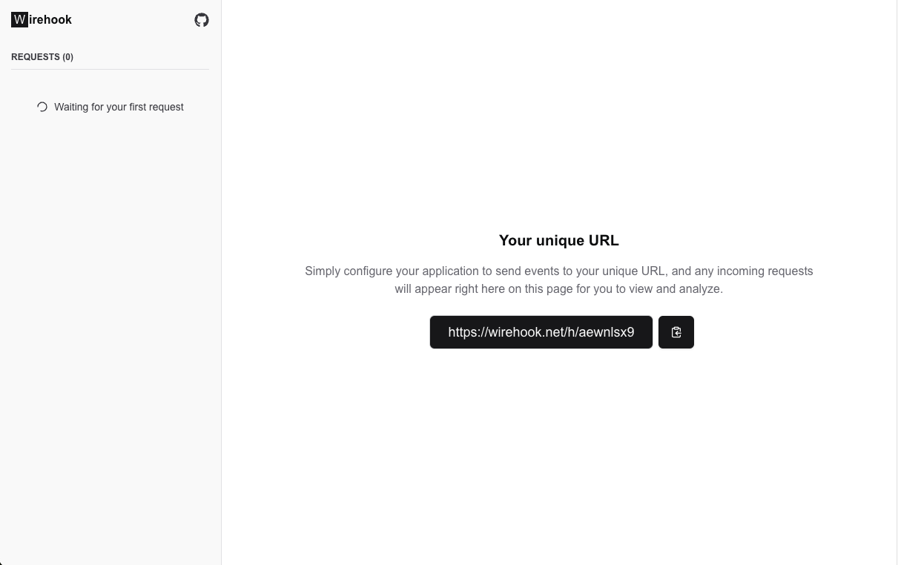

# Wirehook

An open-source, stateless, and hassle-free webhook tester. Designed to be **easy to use**, **secure**, and **lightweight**. Perfect for debugging and testing webhook integrations with zero dependencies on external databases or storage.

<div style="border: 1px solid #ccc; border-radius: 8px; display: inline-block; overflow: hidden;">
  
</div>

## Features

- **Stateless**: No data is stored on the server. Fully ephemeral by design.
- **Simple installation**: One single Docker image is all you need to get started.
- **Unlimited requests**: No caps or restrictions on the number of requests.
- **Self-Hostable**: Host it on your own infrastructure effortlessly.
- **No nonsense**: Minimal setup and overhead.
- **Open Source**: Released under the permissive MIT License.

## Installation

### Using Docker

1. Pull the Docker image:
   ```bash
   docker pull runabol/wirehook
   ```

2. Run the container:
   ```bash
   docker run -d -p 3000:3000 runabol/wirehook
   ```

3. Access the application in your browser at [http://localhost:3000](http://localhost:3000).

### Manual Setup

1. Clone the repository:
   ```bash
   git clone https://github.com/runabol/wirehook.git
   cd wirehook
   ```

2. Install dependencies:
   ```bash
   npm install
   ```

3. Run the development server:
   ```bash
   npm run dev
   ```

4. Open your browser and navigate to [http://localhost:3000](http://localhost:3000).

## Usage

1. Point your webhook to the generated endpoint provided by the app.
2. View incoming requests in real-time on the dashboard.
3. Debug with ease using detailed request logs and payloads.

## Why Stateless?

By keeping the application stateless:
- **Security**: Users don't need to worry about their sensitive information being stored.
- **Performance**: Lightweight and scalable without external storage dependencies.
- **Simplicity**: No need for database setup or configuration.

## License

This project is licensed under the [MIT License](LICENSE). Feel free to use, modify, and distribute it as you see fit.